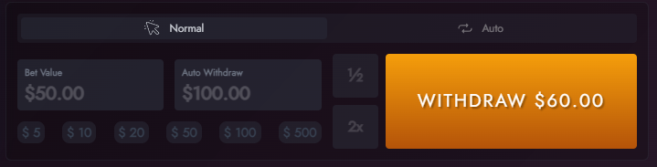

# Desafio Prático de Frontend Hypetech - Motorgrau (Customizado)

Bem-vindo à minha contribuição para o Desafio Prático de Frontend da Hypetech, focada no jogo **Motorgrau**.

[Apresentação das contribuições](https://youtu.be/EafBSnSQ7iM)

## Sobre o Desafio

Este repositório original faz parte do Desafio Prático de Frontend da Hypetech. A proposta do desafio era aprimorar a interface de dois jogos da Hypetech: **Motograu** e **WallStreet**. No meu caso, escolhi trabalhar no jogo **Motorgrau**.

- [Repositório do Desafio Prático de Frontend Hypetech](https://github.com/hypetechgames/frontend-challenge)

## Tecnologias Utilizadas

- React
- Tailwind CSS
- Websocket

## Minhas Alterações

Neste desafio, trabalhei para aprimorar a interface do jogo **Motorgrau**, implementando melhorias e personalizações significativas. Abaixo estão algumas das principais alterações que fiz:

1. **Nova Interface para Desktop e Mobile:**

   - **Objetivo da Mudança:** Aprimorei a interface do projeto, tornando-a responsiva para desktop e mobile.
   - **Pensamento por Trás da Mudança:**
     - **Layout Responsivo:** A interface foi reformulada para proporcionar uma experiência fluida tanto em desktop quanto em dispositivos móveis.
     - **Organização Lógica:** O layout foi reestruturado para otimizar a experiência do usuário. Cerca de 90% da interação do usuário está concentrada no lado esquerdo, onde podem verificar o número de usuários conectados, enviar mensagens no chat (podendo ocultar o chat ou não), realizar apostas e trocar o idioma.
     - **Componentes Centrais:** O núcleo da experiência do jogo foi destacado no centro da tela para fácil acesso e destaque.
     - **Informações Adicionais:** Adicionei um painel à direita, fornecendo informações sobre as apostas e o histórico do usuário. O canto superior direito oferece acesso rápido ao perfil do usuário, status, classificação atual e à missão diária.
     - **Versão Mobile:** Na versão mobile, algumas adaptações foram feitas, como a movimentação do ranking para o perfil e a exibição dos usuários online no topo da aplicação.

   
   

2. **Incluído Novos Componentes:**

   - **Componente de Idioma:**

     - **Objetivo:** Proporcionar mais interação e personalização para os usuários.
     - **Funcionalidade:** Permite aos usuários trocar o idioma da aplicação conforme suas preferências (atualmente apenas pt-BR e en-US).
     - **Posicionamento:** Estrategicamente localizado no lado esquerdo da interface para fácil acesso.

   - **Componente de Desafio Diário:**

     - **Objetivo:** Introduzir desafios diários para engajar os usuários.
     - **Funcionalidade:** Oferece desafios diários aos jogadores, incentivando a participação regular.
     - **Posicionamento:** Integrado ao canto superior direito para fácil visualização, próximo à área do perfil do jogador.

   - **Componente de Ranks Diário:**
     - **Objetivo:** Estimular a competição.
     - **Funcionalidade:** Apresenta o rank atual do jogador.
     - **Posicionamento:** Integrado ao canto superior direito, próximo à área do perfil do jogador.

   **Posicionamento na Navbar:**

   - Todos esses componentes são integrados à navbar, proporcionando fácil acesso e visibilidade.

   

3. **Estilo Personalizado e Adição de Apostas Rápidas:**

   - Personalizei o estilo dos botões para proporcionar uma experiência visual única e atraente.
   - Adicionei botões de apostas rápidas (5, 10, 20, 50, 100 e 500, respectivamente) para facilitar as escolhas dos jogadores.

   
   
   

4. **Funcionalidade Adicional:**

   - O usuário pode ocultar o chat, caso deseje.

   

# Instruções técnicas

Este projeto contém a aplicação das interfaces dos jogos **WallStreet** e **Motograu**:

### 1. Clone o repositório:

```bash
git clone https://github.com/hypetechgames/frontend-challenge
```

### 2. Instale as dependências e inicie o projeto

Acesse a pasta do projeto:

```bash
cd frontend-challenge
```

Instale as dependências do projeto:

```bash
yarn install
```

Inicie o projeto:

```bash
yarn dev
```

### 3. Obtendo um token de acesso ao jogo

Para acessar o jogo é necessário obter um token de acesso que cria uma sessão demonstrativa funcional para desenvolvimento.

Para obtê-lo:

**1 - Acesse a API de Demonstração:**
https://hypetech-demo-api-service-developer.up.railway.app/docs/

**2 - Obtenha um link de demonstração:**

    { "gameUrl": "https://hypetech-games-ui-developer.up.railway.app/44cdf4cec80508c531f71a1929d591c8" }

**3 - Extraia o token obtido:**
~~https://hypetech-games-ui-developer.up.railway.app/~~**44cdf4cec80508c531f71a1929d591c8**

Exemplo: https://i.ibb.co/fp07Mxs/Screen-Recording-2024-01-08-at-17-59-36.gif

**Obs:** Para cada jogo que desejar carregar, você deve gerar um novo token, alterando o parâmetro "game" da requisição:

```json
"game": "motograu",
"lang": "pt",
"currency": "BRL"
```

```json
"game": "wall-street",
"lang": "pt",
"currency": "BRL"
```

**4 - Acesse o jogo:**
Uma vez obtido o token, utilize-o no seu ambiente de desenvolvimento:

**Exemplo - URL do seu ambiente:** http://localhost:8000/
**Exemplo - URL do jogo no seu ambiente:** http://localhost:8000/2b29acad3f7a1e6b0995155668719e66

Caso encontre dificuldade em obter o token seguindo processo acima, você poderá utilizar os tokens públicos abaixo _(ciente que outros desenvolvedores podem estar utilizando a mesma sessão ao mesmo tempo)_:

**Motograu:** 44cdf4cec80508c531f71a1929d591c8
**WallStreet:** 294f24f2c661fc80fd6d12845a3ccdd6

Isso é tudo. A partir de agora você pode acessar o jogo e explorar todas as funcionalidades de forma completa durante seu desenvolvimento.
